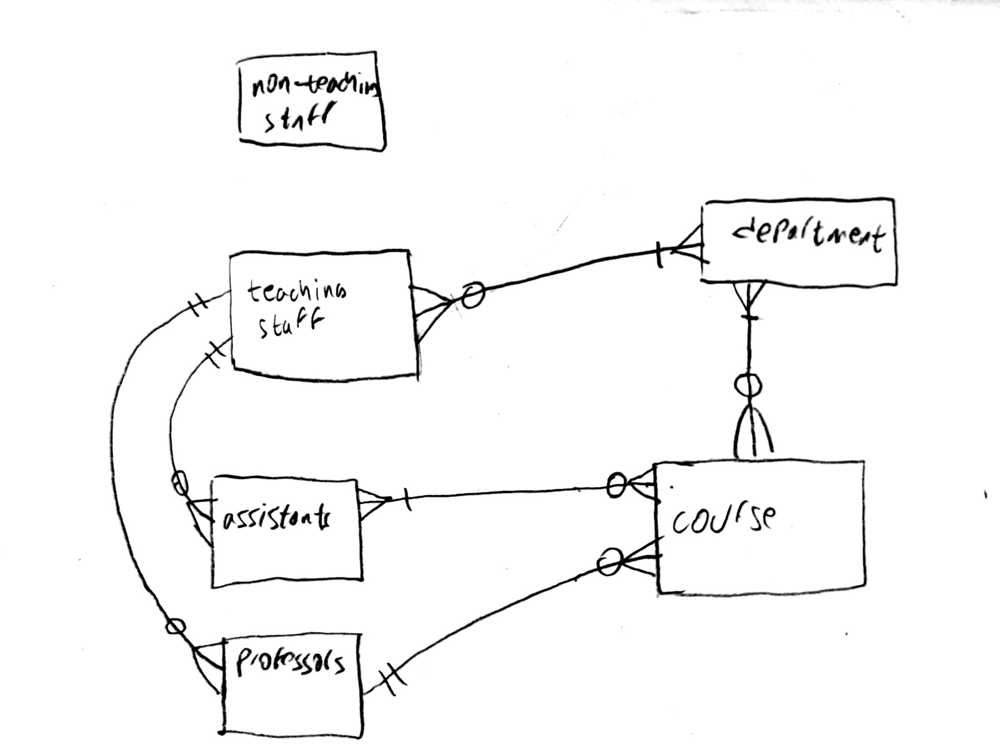

# Faculty of Mechanical Engineering Database

Name: **ZEJD IMAMOVIĆ**

edx/github username: **bearzeze** (https://github.com/bearzeze)

Date and time: *Sarajevo, Bosnia and Herzegovina, 21.03.2024.*

Video overview: [LINK](https://youtu.be/cH9jVbj1ROs)

## Scope

Puropose of my database is to gather all the data needed for describing academic infos at the Faculty of Mechanical Engineering - University of Sarajevo, where I currently work. These informations are related to the all departments within the faculty, all teaching and non-teaching staff, as well as the courses we had on first, second and third cycles, and all years within cycles. Connecting teaching staff, departments and courses was the main focus of this project. All of data are real and can be found on the Faculty web site.

## Functional Requirements

Using this database user can found all the departments, staff and their info, as well as the courses that are taught at the Faculty and their infos. User can insert, update and delete staff and their infos, can set/change head of department, represent department members, and so on.

## Representation

### Entities

This database have next entities through tables:

* **departments** - represents departments that exist at the Faculty. It has following attributes: `id`, `code` and `name`. Both `code` and `name` are the text based type with the required unique values. `id` is small integer because not so much departmens are in the Faculty and used as the primary key.

* **teaching staff** - represents all of the teaching staff and their info. It has following attributes: `id`, `name`, `surname`, `title`, `email`, `phone`, `location` and `curriculum_vitae` as an attributes. All except `id` are text based, but some are constrained to the specific set of values for example `title` ("Teaching Assistant", "Associate Professor", "Professor", ...). `email` is unqiue and required for every teaching staff. Required values are `name`, `surname`, `title` and `email`. `id` is used as the primary key.

* **non-teaching staff** - represents all of the non-teaching staff and their info. Similar to the teaching staff with some differences. `title` and `curriculum_vitae` are not included as the attributes for this entity, and only `name` and `surname`are required. `id` is used as the primary key.

* **department members** - connects teaching staff and department(s) where they operate. It has following attributes:  `id`, `staff_id`, `department_id` and `status` as an attributes. All except `status` are integer based. Because one teacher can be in multiple departments, and one department can have multiple teachers there are no unique constraints.  `status` describes role of the member in the department. Person can have status of "member" or "head of department", where "member" is a default option. Required values are `staff_id` and `department_id`. `id` is used as the primary key. Foreign keys are `staff_id` and `department_id`, which are referencing the **teaching_staff** and **departments** tables respectively.

* **courses** -  represents courses taught at the Faculty with their code and ECTS. It has following attributes: `id`, `name`, `code` and `ECTS` as an attributes. Both `code` and `name` are the text based type with the required unique values. `ECTS` (European Credit Transfer and Accumulation System) represents volume of learning based on the defined learning outcomes and their associated workload and is defined as tiny integer because it is usually in the range of 3-12. `id` is used as the primary key.

* **department courses** - connects courses with departments and give information about the course at some department. Information about course depends on the department. Same course can be taught in the different cycle and year at different departments. It has following attributes:  `id`, `course_id`, `department_id`, `cycle`, `year` and `semester` as an attributes. Text based attributes are `cycle`, `year` and `semester` and are constrained to predetermined values, and all others are integer based. Because one course can be in multiple departments, and one department can have multiple courses there are no unique constraints. All of the attributes are required. `id` is used as the primary key. Foreign keys are `course_id` and `department_id`, which are referencing the **courses** and **departments** tables respectively.

* **course professor** - connects teaching staff - professor and course. It has following attributes:  `id`, `course_id` and `professor_id` as an attributes. All are integer based. Because one course can have only one professor, and one professor can teach multiple courses, `course_id` needs to be unique value. All of the attributes are required. `id` is used as the primary key. Foreign keys are `course_id` and `professor_id`, which are referencing the **courses** and **teaching staff** tables respectively.

* **course assistant** - connects teaching staff - assistant(s) and course. It has following attributes:  `id`, `course_id` and `assistant_id` as an attributes. All are integer based. Because one course can have multiple assistants, and one assistant can teach multiple courses there are no unique values. All of the attributes are required. `id` is used as the primary key. Foreign keys are `course_id` and `assistant_id`, which are referencing the **courses** and **teaching staff** tables respectively.

Setting/changing the status of the department member is done by using procedure called **SetHeadDepartment**. It requires two parameters - staff_id of the person who will be the head of department, and department code. Proceduce always first check whether the staff_id is from the department where we want to set/change head of department, if not it produces error. It will produce an error if we want to appoint current head to become a new one - redundant action. Otherwise it checks whether there is a current head of department in the department, and if not new head of department becomes head. Otherwise if replacement is on going, new head will have new status of "head of department", and old one will have status of "member" of the department.

### Relationships

Entity relationship (ER) diagram of the database:

## Optimizations

For the searching optimization purposes several indexes are created such as:
* teaching_surname_index ON `teaching_staff` (`surname`)
* teaching_title_index ON `teaching_staff` (`title`)
* non_teaching_surname_index ON `non_teaching_staff` (`surname`)
* department_index ON `department_members` (`department_id`)
* staff_index ON `department_members` (`staff_id`)
* courses_name_index ON `courses` (`name`)
* cycle_index ON `department_courses` (`cycle`)
* course_id_dc_index ON `department_courses` (`course_id`)
* department_id_index ON `department_courses` (`department_id`)
* course_id_cp_index ON `course_professor` (`course_id`)
* professor_id_index ON `course_professor` (`professor_id`)
* course_id_ca_index ON `course_assistant` (`course_id`)
* assistant_id_index ON `course_assistant` (`assistant_id`)

There are five views that facilitate a clear understanding of the data relationships between tables:
* *staff* - which unite teaching and non-teaching staff into one table, were the title for the non-teaching staff is just "Staff", and NULL for the CV and location in the building.

* *department_staff* - which joins two tables **departments** and **teaching_staff** using the **department_members** cross-relational table into one view. It provides a convenient way to view all staff members associated with specific department(s).

*  *heads_of_departments*  - give only head(s) of the department(s) drom the *department_staff* view, for the staff which have the `status` of "head_of_department"

* *courses_info* - which joins two tables **departments** and **courses** using the **department_courses** cross-relational table into one view. It provides all of the course information taught in each department. First two year are almost the same for every department. It is sorted by `department`, `cycle`, `year`, `semester` and `ECTS`.

* *courses_teachers* - which joins two tables **teaching_staff** and **courses** using the **course_professor** and **course_assistant** cross-relational tables into one view. It provides information about who is in charge of teaching for every course.

## Limitations

There are plenty of data to be inserted in (maybe .csv files would help, or using programming languages). There are no place for the external collaborators, which are indispensable part of the academy functioning. Also **students** and **materials** should be included into the database, so student who are enrolled into the course, could download material which is related to table and so on. But this project is solid base for creating full database for Faculty or even University in larger scale.

For all information contact me **i.zejd@hotmail.com**
